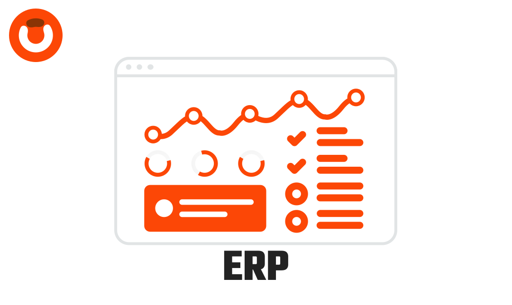

<p align="center"><a href="#" target="_blank"></a></p>

<p align="center">
  <a href="https://packagist.org/packages/obelaw/erp-system" target="_blank"></a>
  <a href="https://packagist.org/packages/obelaw/erp-system" target="_blank"></a>
</p>

# Obelaw ERP

Laravel Framework-based ERP System integrated with Filament for streamlined operations.

## Documentation

### Installation

Install via composer.

```bash
composer create-project obelaw/erp-system

php artisan migrate
php artisan twist:migrate
php artisan permit:add-default-user
php artisan serve // GO TO 127.0.0.1:8000/obelaw
```
